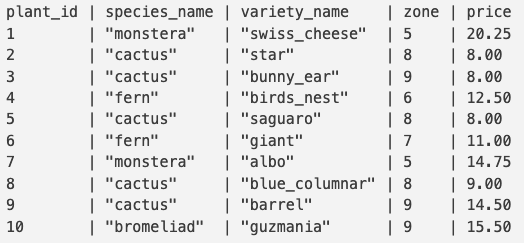
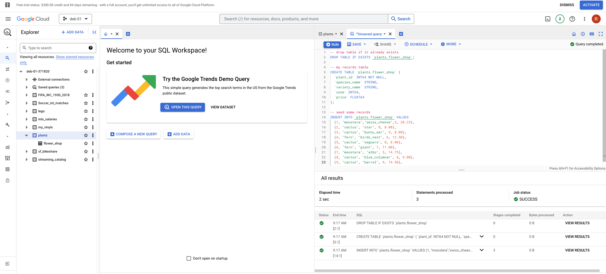
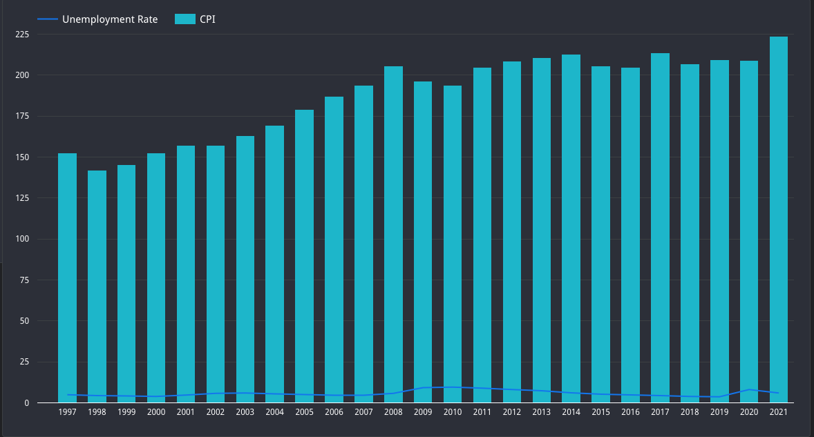

# Code Review: BigQuery and Cloud

#### By Ruben Giosa

#### This repo includes exercises for working with BigQuery and Looker.

<br>

## Technologies Used

* Google BigQuery
* Google Looker Studio
* Python
* Jupyter Notebooks
* SQL
* Git
* Markdown
* `.gitignore`
* `requirements.txt`

</br>

## Description
This repo includes exercises for working with BigQuery and Looker, and is broken out into two different parts. 

### Part 1: This section focuses on 1) using Python to create a BigQuery client 2) using BigQuery console to make a dataset called 'plants' 3) using Python to list the datasets in the BigQuery project in order to confirm that the new 'plants' dataset is there 4) create `create_table.sql` that contains the SQL code that will create a table in the plants dataset called flower_shop, giving it a schema and inserting values into it so it looks like this:



<br>

Then I ran the code in `create_table.sql` in BigQuery to create the table:



Finally, using Python, I listed the tables in the plants dataset, and confirmed the new flower_shop table was there.

### Part 2: The second part of the code review is covered in `part_two.ipynb`, which outlines the objectives, steps taken and the outputs from [US Inflation and Unemployment](https://console.cloud.google.com/marketplace/product/bls-public-data/cpi-unemployement?project=deb-01-371820) public dataset I selected from BigQuery. Below are the visualizations I put together using Looker Studio:

<br>

#### Graph 1:


Description: Graph 1 above plots the annual CPI value by year, which is interesting as it can be seen that the period leading up to 2008 was highly inflationary, and then following the 'Great Recession' we see that CPI has a material drop until 2018 (deflationary), then resumes its increase with an abrupt spike from 2020 to 2021.

<br>

#### Graph 2:


Description: The combo bar and line graph (Graph 2) plots the CPI value by year (bar) and Unemployment rate (line). One interesting data point, is that that the drop in CPI discussed in the above description regarding the CPI line graph, seems to have a correlation with the increase in the Unemployment rate, as we see an increase in the rate over that 2008 to 2010 period.


## Setup/Installation Requirements

* Go to https://github.com/rgiosa10/bigquery-cloud-cr.git to find the specific repository for this website.
* Then open your terminal. I recommend going to your Desktop directory:
    ```bash
    cd Desktop
    ```
* Then clone the repository by inputting: 
  ```bash
  git clone https://github.com/rgiosa10/bigquery-cloud-cr.git
  ```
* Go to the new directory or open the directory folder on your desktop:
  ```bash
  cd bigquery-cloud-cr
  ```
* Open the directory:
  ```bash
  code .
  ```
* If there is interest to access or view the contents of this project on BigQuery and Looker please reach out and we can discuss getting access.

</br>

## Known Bugs

* No known bugs

<br>

## License

MIT License

Copyright (c) 2022 Ruben Giosa

Permission is hereby granted, free of charge, to any person obtaining a copy of this software and associated documentation files (the "Software"), to deal in the Software without restriction, including without limitation the rights to use, copy, modify, merge, publish, distribute, sublicense, and/or sell copies of the Software, and to permit persons to whom the Software is furnished to do so, subject to the following conditions:

The above copyright notice and this permission notice shall be included in all copies or substantial portions of the Software.

THE SOFTWARE IS PROVIDED "AS IS", WITHOUT WARRANTY OF ANY KIND, EXPRESS OR IMPLIED, INCLUDING BUT NOT LIMITED TO THE WARRANTIES OF MERCHANTABILITY, FITNESS FOR A PARTICULAR PURPOSE AND NONINFRINGEMENT. IN NO EVENT SHALL THE AUTHORS OR COPYRIGHT HOLDERS BE LIABLE FOR ANY CLAIM, DAMAGES OR OTHER LIABILITY, WHETHER IN AN ACTION OF CONTRACT, TORT OR OTHERWISE, ARISING FROM, OUT OF OR IN CONNECTION WITH THE SOFTWARE OR THE USE OR OTHER DEALINGS IN THE SOFTWARE.

</br>